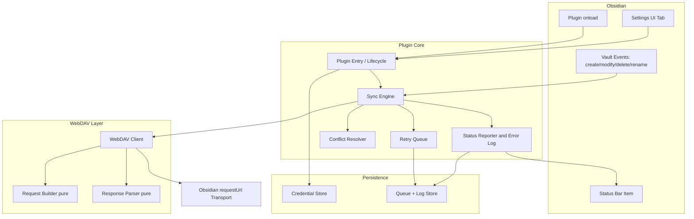

# Design Document

## Overview

This document describes the technical design for an Obsidian community plugin that synchronizes an Obsidian vault with a Synology NAS WebDAV server. The plugin targets both desktop (macOS) and mobile (iOS) and provides a free, self-hosted alternative to paid sync services.

The central design problem is reliable WebDAV communication with Synology's server implementation across two very different runtime environments. On mobile, the standard browser `fetch` API is blocked by cross-origin (CORS) restrictions, and Synology's WebDAV backend does not emit the CORS preflight headers a browser would require. The design solves this by routing **all** HTTP traffic through Obsidian's `requestUrl()` API, which performs requests from the native layer and bypasses CORS on every platform. This is the same approach used by mature sync plugins such as `remotely-save`.

### Research Summary

Key findings that inform this design:

- **Obsidian `requestUrl()` bypasses CORS on desktop and mobile.** The community consensus is that there is no reliable way to bypass CORS on mobile other than Obsidian's `request()`/`requestUrl()` API ([Obsidian forum: CORS problem with library](https://forum.obsidian.md/t/cors-problem-with-library/26703), [Make HTTP requests from plugins](https://forum.obsidian.md/t/make-http-requests-from-plugins/15461)). `requestUrl()` accepts arbitrary HTTP methods (so `PROPFIND`, `MKCOL`, `MOVE`, `PUT`, `DELETE` work), custom headers, and a string or `ArrayBuffer` body, and returns status, headers, text, and `arrayBuffer`. Content was rephrased for compliance with licensing restrictions.
- **Synology WebDAV rejects `Depth: infinity`.** Like many WebDAV servers, Synology disallows recursive `PROPFIND` with `Depth: infinity` and expects `Depth: 1` for directory listings ([Sabre/Dav Depth discussion](https://stackoverflow.com/questions/34878989/allow-propfind-with-depth-infinity-requests-in-sabredav)). The design therefore walks the tree one directory level at a time using `Depth: 1`, satisfying Requirement 4.2. Content was rephrased for compliance with licensing restrictions.
- **Synology WebDAV is a separate package with its own ports.** Synology's "WebDAV Server" package commonly serves HTTP on port 5005 and HTTPS on port 5006, distinct from DSM. The plugin treats the server endpoint as an opaque base URL supplied by the user rather than hard-coding ports, satisfying Requirement 4.5 (trailing-slash and path resolution handled by a URL join helper).
- **Self-signed certificates are common on Synology.** Many self-hosted Synology servers use self-signed TLS certs. `requestUrl()` performs TLS validation at the native layer; the design surfaces TLS failures as a connectivity failure with actionable messaging rather than silently failing.

### Goals

- Single networking path (`requestUrl()`) shared by desktop and mobile.
- A WebDAV layer that isolates Synology-specific quirks (auth header, `Depth: 1`, redirects, URL joining, timeouts).
- Pure, testable cores for request building, response parsing, sync decisions, conflict naming, and the retry queue, so correctness can be verified with property-based tests.
- Durable behavior: the retry queue and error log survive restarts.

### Non-Goals

- Real-time collaborative editing or operational-transform merging. Conflicts are preserved as conflict-copy files, not merged.
- Sync backends other than WebDAV.
- Block-level / delta sync. Transfers are whole-file.

## Architecture

The plugin is organized in layers so that platform-specific and I/O-bound concerns are separated from pure logic that can be property-tested.



### Layer Responsibilities

- **Plugin Core / Lifecycle** — Registers settings, commands, vault event listeners, and the status bar within the 5-second budget (Req 1.3–1.5). Triggers fetch-on-open (Req 7).
- **Sync Engine** — Orchestrates full sync, fetch-on-open, and per-change automatic sync. Owns the timestamp-comparison decision logic (Req 6, 7, 8) and delegates conflicts and retries.
- **Retry Queue** — A persistent, bounded FIFO of pending changes with attempt counts and scheduled retries (Req 8.5–8.7).
- **Conflict Resolver** — Detects conflicts and generates non-colliding conflict-copy names (Req 9).
- **Status Reporter / Error Log** — Drives the status bar and maintains a bounded, persisted error log (Req 10).
- **WebDAV Client** — Stateful adapter that composes auth headers, applies `Depth: 1`, follows redirects (≤5), enforces the 30-second timeout, and joins URLs against the configured endpoint (Req 4). Pure building/parsing is delegated to the Request Builder and Response Parser.
- **Request Builder (pure)** — Produces well-formed PROPFIND XML bodies (Req 5.3).
- **Response Parser (pure)** — Converts multistatus XML into a `RemoteFileListing` (Req 5.1–5.6).
- **Transport** — Thin wrapper over `requestUrl()`; the only module that performs network I/O. Swappable with a fake in tests.

### Platform Strategy

The plugin sets `isDesktopOnly: false` in `manifest.json` (Req 1.1). All network access flows through the Transport wrapper around `requestUrl()`, so no desktop-exclusive API (e.g. Node `fs`, `http`, `net`) is referenced anywhere (Req 1.2, 4.6). File access uses Obsidian's `Vault` and `DataAdapter` APIs, which are available on mobile.

## Components and Interfaces

### Transport

```typescript
interface HttpRequest {
  url: string;
  method: string; // GET, PUT, DELETE, PROPFIND, MKCOL, MOVE, ...
  headers: Record<string, string>;
  body?: string | ArrayBuffer;
}

interface HttpResponse {
  status: number;
  headers: Record<string, string>;
  text: string;
  arrayBuffer: ArrayBuffer;
}

interface Transport {
  // Wraps Obsidian requestUrl(). Never throws on non-2xx; returns the response.
  // Rejects only on transport-level failure (unreachable host, TLS error, timeout).
  send(request: HttpRequest, timeoutMs: number): Promise<HttpResponse>;
}
```

The production implementation calls `requestUrl({ ..., throw: false })` and races it against a 30-second timeout (Req 4.7, 4.8). Tests inject a fake `Transport` to exercise the WebDAV client and Sync Engine without a network.

### WebDAV Client

```typescript
interface WebDAVClient {
  // PROPFIND Depth:1 on a single directory.
  listDirectory(remotePath: string): Promise<RemoteFileListing>;
  // Recursive listing built from repeated Depth:1 calls.
  listTree(remotePath: string): Promise<RemoteFileListing>;
  getFile(remotePath: string): Promise<ArrayBuffer>;
  putFile(remotePath: string, content: ArrayBuffer): Promise<void>;
  deleteFile(remotePath: string): Promise<void>;
  moveFile(fromPath: string, toPath: string): Promise<void>;
  makeCollection(remotePath: string): Promise<void>; // MKCOL, recursive parents
  testConnection(): Promise<ConnectionTestResult>;
}
```

Behaviors enforced by the client:

- Adds `Authorization: Basic base64(username:password)` to every request (Req 4.1).
- Sends `Depth: 1` for `PROPFIND` (Req 4.2).
- Follows `301/302/307/308` redirects up to 5 times, then aborts with a redirect-limit error (Req 4.3, 4.4).
- Joins `remotePath` against the configured endpoint with correct slash handling, URL-encoding each path segment (Req 4.5).
- Maps `401` to authentication failure and stops the operation (Req 4.9).

### Request Builder (pure)

```typescript
interface RequestBuilder {
  // Builds a well-formed PROPFIND body requesting displayname/href path,
  // getlastmodified, and getcontentlength.
  buildPropfindBody(): string;
}
```

### Response Parser (pure)

```typescript
interface ResponseParser {
  // Parses a 207 Multistatus XML document into a listing.
  // Returns a discriminated result: { ok: true, listing } | { ok: false, error }.
  parseMultistatus(xml: string): ParseResult;
}

type ParseResult =
  | { ok: true; listing: RemoteFileListing }
  | { ok: false; error: "malformed-xml" };
```

Parsing rules: include only `<response>` entries whose per-resource `<status>` indicates success (2xx) and that carry path, last-modified, and size; exclude entries missing any required field or with a failure status (Req 5.5); a well-formed document with zero successful entries yields an empty listing (Req 5.6); non-XML input yields `malformed-xml` (Req 5.4). XML parsing uses the platform `DOMParser`, which is available on mobile.

### Sync Engine

```typescript
interface SyncEngine {
  fullSync(): Promise<SyncReport>;          // Req 6
  fetchOnOpen(): Promise<void>;             // Req 7
  handleLocalChange(change: LocalChange): Promise<void>; // Req 8
}

// Pure decision function — no I/O. The heart of sync correctness.
function decideAction(local: FileMeta | null, remote: FileMeta | null): SyncAction;

type SyncAction =
  | "upload" | "download" | "skip" | "conflict" | "delete-remote";

interface SyncReport {
  uploaded: number;
  downloaded: number;
  failed: FailedTransfer[];
}
```

`decideAction` encapsulates the timestamp comparison with a 2-second equality window (Req 6.3) and the missing-on-one-side rules (Req 6.1, 6.2, 7.2–7.4). Each transfer is retried up to 3 extra attempts inside `fullSync` (Req 6.5) and a failure does not stop the run (Req 6.6).

### Retry Queue

```typescript
interface RetryQueue {
  enqueue(change: PendingChange): boolean; // false if at capacity (1000)
  size(): number;
  due(now: number): PendingChange[];       // changes whose nextAttemptAt <= now
  recordResult(id: string, success: boolean): void; // advances attempt/backoff
  persist(): Promise<void>;
  load(): Promise<void>;
}
```

The queue is bounded to 1000 entries (Req 8.5), retries due changes every 30 seconds up to 10 attempts (Req 8.5), keeps exhausted changes and signals failure after attempt 10 (Req 8.6), and persists to disk so entries survive restart (Req 8.7).

### Conflict Resolver

```typescript
interface ConflictResolver {
  // Generates a conflict-copy name from the original path that does not
  // collide with any existing vault path.
  conflictCopyName(originalPath: string, existingPaths: Set<string>): string;
  resolve(file: ConflictInput): Promise<ConflictOutcome>;
}
```

The generated name embeds the original base name plus a unique identifier (timestamp + device tag); if it still collides, an additional identifier is appended until unique (Req 9.2, 9.3). The original file name is never changed (Req 9.1).

### Settings UI

A `PluginSettingTab` with masked password input, field validation (Req 2.1–2.3, 2.7, 2.8), a save action with confirmation (Req 2.4, 2.5), and a "Test Connection" button that disables itself while running (Req 3.1, 3.8). Stored settings are loaded into the fields on open (Req 2.6).

### Status Reporter

A status-bar item plus a notice/log surface that reflects idle/in-progress/success/error states within the required latencies (Req 10.1–10.3, 10.6) and an error-log view ordered newest-first (Req 10.4, 10.5).

## Data Models

```typescript
interface ConnectionSettings {
  endpoint: string;   // 1..2048 chars, http(s) scheme + host
  username: string;   // 1..255 chars
  password: string;   // 1..255 chars
}

// A remote or local file's identity used for sync decisions.
interface FileMeta {
  path: string;        // vault-relative, normalized with forward slashes
  modifiedUtc: number; // epoch milliseconds, UTC
  size: number;        // integer bytes, 0 .. 2^63-1
}

interface RemoteFileListing {
  entries: FileMeta[];
}

type ChangeKind = "create" | "modify" | "delete" | "rename";

interface PendingChange {
  id: string;
  kind: ChangeKind;
  path: string;
  fromPath?: string;     // for rename
  attempts: number;      // 0..10
  nextAttemptAt: number; // epoch ms
}

interface ConnectionTestResult {
  kind: "success" | "auth-failure" | "connectivity-failure"
      | "timeout" | "missing-settings";
  message: string;
}

interface ErrorLogEntry {
  timestampUtc: number;
  description: string;
}

interface SyncStatus {
  state: "idle" | "in-progress" | "success" | "error";
  timestampUtc?: number;
  description?: string;
}
```

### Persistence

- **Connection settings** are stored via the plugin's `saveData()`/`loadData()` (the `Credential_Store`). Credentials are stored locally on-device; the design notes that Obsidian plugin data is not encrypted at rest, which is documented to the user in the settings screen.
- **Retry queue** and **error log** are persisted in the same plugin data store, loaded on `onload`, and written on change so they survive restarts (Req 8.7, 10.4).


## Correctness Properties

*A property is a characteristic or behavior that should hold true across all valid executions of a system — essentially, a formal statement about what the system should do. Properties serve as the bridge between human-readable specifications and machine-verifiable correctness guarantees.*

The properties below target the plugin's **pure cores** — the Response Parser, Request Builder, `decideAction`, the URL-join helper, the Conflict Resolver's naming function, the Retry Queue, settings validation, and the error log. These are deterministic, I/O-free, and exercised with a fake `Transport` where a request boundary is involved, so each property can run 100+ iterations cheaply. UI rendering, lifecycle timing, and live-server behavior are intentionally excluded (they appear as example/integration/smoke tests in the Testing Strategy).

### Property 1: Sync decision is correct across all file-pair states

*For any* pair of `FileMeta | null` values `(local, remote)`, `decideAction(local, remote)` SHALL be:
- `upload` when the remote is absent or the local timestamp is more than 2000 ms newer than the remote;
- `download` when the local is absent or the remote timestamp is more than 2000 ms newer than the local;
- `skip` when both are present and their timestamps differ by 2000 ms or less (the equality window, inclusive of exactly 2000 ms);
- and the function SHALL never transfer either file when it returns `skip`.

**Validates: Requirements 6.1, 6.2, 6.3, 7.2, 7.3, 7.4**

### Property 2: Multistatus parse round-trip preserves entries

*For any* `RemoteFileListing`, rendering it as an equivalent well-formed WebDAV `207 Multistatus` response and parsing that response SHALL yield a listing whose entries preserve each original entry's path, last-modified time (as a UTC epoch-ms timestamp), and size (as an integer in `[0, 2^63-1]`). Equivalently, `parseMultistatus(render(listing)).listing` equals `listing`.

**Validates: Requirements 5.1, 5.2, 5.3, 5.7**

### Property 3: Parser excludes unsuccessful or incomplete entries and rejects malformed input

*For any* generated multistatus document (including documents with entries that have a non-2xx per-resource status, entries missing path/last-modified/size, documents with zero successful entries, and non-XML byte sequences), the parser SHALL include exactly those `<response>` entries whose per-resource status is success and that carry all three required fields; SHALL produce an empty listing when no entry qualifies; and SHALL return `malformed-xml` with no listing when the input is not well-formed XML.

**Validates: Requirements 5.4, 5.5, 5.6**

### Property 4: URL join resolves correctly against the endpoint

*For any* configured endpoint (with or without a trailing slash) and *any* vault-relative path, the joined request URL SHALL preserve the endpoint's scheme and host (origin), contain exactly one `/` separator between the endpoint base path and the resolved path (no missing and no doubled separators), and percent-encode each path segment of the vault-relative path.

**Validates: Requirements 4.5**

### Property 5: Every request carries Basic auth and every PROPFIND uses Depth 1

*For any* `ConnectionSettings` and *any* WebDAV client operation, the `HttpRequest` handed to the `Transport` SHALL include an `Authorization: Basic <base64(username + ":" + password)>` header derived from those settings; and *for any* directory-listing operation, every `PROPFIND` request observed by the `Transport` SHALL carry the header `Depth: 1`.

**Validates: Requirements 4.1, 4.2**

### Property 6: Redirect following is bounded at five

*For any* redirect chain returned by the `Transport`, the client SHALL follow up to 5 consecutive redirects to a final response when the chain length is 5 or fewer, and SHALL abort with a redirect-limit error performing no local file writes when the chain exceeds 5 redirects.

**Validates: Requirements 4.3, 4.4**

### Property 7: Conflict-copy names are unique and non-destructive

*For any* original vault path and *any* set of existing vault paths, `conflictCopyName(originalPath, existingPaths)` SHALL return a name that (a) contains the original file's base name, (b) is not a member of `existingPaths`, and (c) is different from `originalPath`, so that no existing file is overwritten and the original file's name is never changed.

**Validates: Requirements 9.1, 9.2, 9.3**

### Property 8: Retry queue respects capacity, attempt, and scheduling bounds

*For any* sequence of `enqueue` and `recordResult(success=false)` operations, the retry queue SHALL maintain `size() <= 1000`; `enqueue` SHALL return `false` (and not grow the queue) once 1000 entries are held; no entry's `attempts` SHALL exceed 10; a change driven to 10 failed attempts SHALL remain in the queue (flagged failed) rather than being silently dropped; and `due(now)` SHALL return only entries whose `nextAttemptAt <= now`, with each failed attempt advancing `nextAttemptAt` by at least the 30-second retry interval.

**Validates: Requirements 8.5, 8.6**

### Property 9: Retry queue survives a persist/load round-trip

*For any* retry-queue contents, calling `persist()` and then `load()` into a fresh queue SHALL reconstruct an equal queue (same set of pending changes with identical `id`, `kind`, `path`, `fromPath`, `attempts`, and `nextAttemptAt`).

**Validates: Requirements 8.7**

### Property 10: Settings validation rejects invalid input without mutating the store

*For any* `ConnectionSettings` candidate that violates a rule — endpoint not beginning with `http://` or `https://`, endpoint lacking a host, endpoint longer than 2048 characters, or username/password that is empty or longer than 255 characters — validation SHALL reject the save and the stored `ConnectionSettings` SHALL be unchanged; and *for any* candidate satisfying all rules, validation SHALL accept it.

**Validates: Requirements 2.7, 2.8**

### Property 11: Saved settings round-trip through the credential store

*For any* valid `ConnectionSettings`, persisting them via the credential store and then loading them SHALL return settings equal to those saved.

**Validates: Requirements 2.4**

### Property 12: Connection test yields exactly one result and gates on missing settings

*For any* simulated transport outcome (successful auth, `401`, network failure, no-response timeout) the connection test SHALL produce exactly one `ConnectionTestResult.kind` from the allowed set `{success, auth-failure, connectivity-failure, timeout, missing-settings}`; and *for any* settings with at least one empty required field, the result SHALL be `missing-settings` and the `Transport` SHALL never be invoked.

**Validates: Requirements 3.6, 3.7**

### Property 13: Sync report accounts for every file and isolates failures

*For any* set of file pairs processed by a full synchronization (with a fake `Transport` that fails an arbitrary subset of transfers), the resulting `SyncReport` counts of `uploaded`, `downloaded`, and `failed` SHALL equal the actual number of upload, download, and exhausted-retry outcomes; the totals SHALL account for every processed file exactly once; and the presence of any failed transfer SHALL NOT prevent the remaining non-failing transfers from completing.

**Validates: Requirements 6.4, 6.6**

### Property 14: Fetch-on-open performs no work without valid settings

*For any* `ConnectionSettings` missing one or more required fields, `fetchOnOpen()` SHALL make no `Transport` calls and SHALL perform no vault writes (the vault is left unchanged).

**Validates: Requirements 7.7**

### Property 15: Error log is bounded and ordered newest-first

*For any* sequence of logged error entries, the error log SHALL retain at least the 50 most recent entries, SHALL never discard a newer entry in favor of an older one, and SHALL present entries ordered from most recent to oldest (non-increasing by timestamp).

**Validates: Requirements 10.4, 10.5**

## Error Handling

Errors are classified at the layer that can best interpret them and surfaced to the user through the Status Reporter and the persisted error log. The guiding principle is **fail safe**: a failed network operation must never corrupt or partially overwrite local files, and every failure produces exactly one user-visible classification plus a log entry (Req 10.3, 10.4).

The `Transport` never throws on an HTTP status; it returns the `HttpResponse` so the WebDAV Client can interpret the status code. The `Transport` rejects only on transport-level failures (unreachable host, TLS validation failure, timeout), which the client maps to the categories below.

| Failure | Detected by | Classification | Behavior |
| --- | --- | --- | --- |
| Authentication rejected (HTTP 401) | WebDAV Client | `auth-failure` | Stop the current operation immediately; do not proceed with sync; surface "authentication failed" status and log entry. Connection_Settings are retained unchanged. (Req 3.3, 4.9) |
| Server unreachable / TLS validation failure | Transport → WebDAV Client | `connectivity-failure` | Abort the request without altering local files; surface a connectivity-failure status. For automatic per-change sync, enqueue the change for retry (see queue-at-capacity below). (Req 3.4, 8.5) |
| No response within 30 s | Transport (timeout race) | `timeout` | Abort the request, surface a timeout status, leave local files unchanged. The `requestUrl()` call is abandoned via `Promise.race` against a 30-second timer. (Req 3.5, 4.7, 4.8) |
| Redirect limit exceeded (> 5 consecutive redirects) | WebDAV Client | `redirect-limit` | Abort the request with a "redirect limit exceeded" error; perform no local file writes. (Req 4.4) |
| Malformed (non-well-formed) XML response | Response Parser | `malformed-xml` | Return a parse error; produce no Remote_File_Listing. The calling sync operation treats the affected listing as a failed fetch and reports it without modifying the vault. (Req 5.4) |
| Missing required Connection_Settings | Settings/validation gate | `missing-settings` | For a Connection_Test, return the missing-settings result without contacting the server. For fetch-on-open, skip the fetch and leave the vault unchanged. (Req 3.7, 7.7) |
| Listing fetch fails before any download (fetch-on-open) | Sync Engine | error notification | Display a notification identifying the failure; leave the vault entirely unchanged. (Req 7.5) |
| Partial fetch failure after one or more downloads | Sync Engine | partial-failure notification | Retain the already-downloaded files; display a notification identifying the partial failure. Downloaded files are written atomically per file so a mid-batch failure never leaves a half-written file. (Req 7.6) |
| Single transfer fails during full sync | Sync Engine | per-file retry then `failed` | Retry the individual transfer up to 3 additional attempts; if still failing, classify the file as failed, continue with the remaining files, and include the file (with its cause) in the SyncReport. (Req 6.5, 6.6) |
| Conflict-copy write failure | Conflict Resolver | error notification | Retain both the local and remote versions without modification; display an error notification naming the affected file and indicating conflict-copy creation failed. No data is discarded. (Req 9.5) |
| Retry queue at capacity (1000 pending) | Retry Queue | drop-with-error | `enqueue` returns `false`; the Sync Engine surfaces an error notification that the change could not be queued because the retry queue is full, so the user is aware the change is not pending. Existing queued changes are preserved. (Req 8.5) |
| Queued change exhausts 10 attempts | Retry Queue / Sync Engine | persistent `failed` | Retain the change in the queue (do not drop it) and display an error notification that synchronization of that file failed. (Req 8.6) |
| Initialization exceeds 5 s | Plugin lifecycle | load-failure | Abort initialization, display a "plugin failed to load" message, and leave existing notes and settings unchanged. (Req 1.5) |

**Cross-cutting rules:**

- **No partial writes.** Downloads and conflict copies are written via the Vault/DataAdapter API as complete files; a transport failure mid-transfer leaves the destination file untouched (Req 4.8, 7.5, 9.5).
- **One classification per failure.** Each failed operation maps to exactly one of the categories above, satisfying the single-result-type requirements (Req 3.6, 10.3).
- **Every error is logged.** Connectivity, auth, timeout, redirect-limit, parse, and conflict failures each append an `ErrorLogEntry` with a UTC timestamp and human-readable description; the log retains at least the 50 most recent entries newest-first (Req 10.4, 10.5).
- **Credentials are never altered by a failure.** No failure path mutates the stored Connection_Settings (Req 3.3, 3.4).

## Testing Strategy

The plugin separates pure logic from I/O specifically so that the bulk of correctness can be verified off-device with fast, deterministic tests, while a small set of manual procedures covers what only a real Synology server and real devices can exercise. Testing therefore has three tiers: property-based tests for the pure cores, unit/integration tests with a fake `Transport`, and manual end-to-end verification on macOS and iOS — including a manual connection check the user runs against their own server before relying on sync.

### Tooling

- **Test runner:** the project's TypeScript test runner (e.g. Vitest/Jest) for unit and property tests, run with a single-execution flag rather than watch mode.
- **Property-based library:** [fast-check](https://github.com/dubzzz/fast-check) for TypeScript. The plugin does not implement property testing from scratch.
- **Iterations:** each property-based test runs a minimum of **100 iterations** (`fast-check` `numRuns: 100` or higher).
- **Tagging:** each property test carries a comment tying it to its design property, in the format `Feature: obsidian-synology-webdav-sync, Property {number}: {property_text}`.
- **Fakes:** a `FakeTransport` implementing the `Transport` interface records every `HttpRequest` and returns scripted `HttpResponse` values (including redirect chains, 401s, malformed XML, and never-resolving promises for timeout tests). A fake clock (`fast-check` integration or the runner's fake timers) drives the 30-second timeout and 30-second retry interval without real waiting.

### Property-Based Tests (pure cores)

Each correctness property maps to exactly one property-based test, all using `fast-check` generators:

| Property | Generator(s) | What is asserted |
| --- | --- | --- |
| Property 1 — `decideAction` | pairs of `FileMeta \| null` with timestamps clustered around the 2000 ms boundary | correct upload/download/skip including the inclusive 2 s equality window (Req 6.1–6.3, 7.2–7.4) |
| Property 2 — parse round-trip | arbitrary `RemoteFileListing` (paths, UTC mtimes, sizes in `[0, 2^63-1]`) | `parse(render(listing))` preserves path/mtime/size (Req 5.1–5.3, 5.7) |
| Property 3 — parse filtering/malformed | multistatus docs with mixed success/failure statuses, missing fields, zero-success, and non-XML strings | only complete successful entries kept; empty listing when none; `malformed-xml` on bad input (Req 5.4–5.6) |
| Property 4 — URL join | endpoints with/without trailing slash × arbitrary vault-relative paths | single separator, preserved origin, per-segment percent-encoding (Req 4.5) |
| Property 5 — request invariants | arbitrary settings × client operations | Basic auth on every request; `Depth: 1` on every PROPFIND (Req 4.1, 4.2) |
| Property 6 — redirect bound | redirect chains of length 0..N | follows ≤ 5, aborts with redirect-limit error and no writes beyond 5 (Req 4.3, 4.4) |
| Property 7 — conflict naming | arbitrary original path × arbitrary existing-path sets | name contains base name, not in existing set, differs from original (Req 9.1–9.3) |
| Property 8 — retry queue bounds | arbitrary sequences of enqueue/recordResult | size ≤ 1000, enqueue past capacity returns false, attempts ≤ 10, 30 s scheduling (Req 8.5, 8.6) |
| Property 9 — queue persistence | arbitrary queue contents | `persist()` then `load()` reconstructs an equal queue (Req 8.7) |
| Property 10 — settings validation | arbitrary valid/invalid endpoint/username/password | invalid rejected with no store mutation; valid accepted (Req 2.7, 2.8) |
| Property 11 — settings round-trip | arbitrary valid settings | save then load returns equal settings (Req 2.4) |
| Property 12 — connection-test result | scripted transport outcomes + settings completeness | exactly one result kind; missing fields → `missing-settings`, no Transport call (Req 3.6, 3.7) |
| Property 13 — sync report accounting | sets of file pairs with an arbitrary failing subset (FakeTransport) | counts match actual outcomes; every file counted once; failures don't halt the run (Req 6.4, 6.6) |
| Property 14 — fetch settings-gate | settings missing required fields | no Transport calls, no vault writes (Req 7.7) |
| Property 15 — error log | arbitrary sequences of error entries | ≥ 50 most recent retained, newest-first ordering (Req 10.4, 10.5) |

### Unit and Integration Tests (with FakeTransport)

Example-based tests cover specific scenarios and edge cases that don't benefit from randomization, all using `FakeTransport` so no network is required:

- **Connection-test mappings:** 401 → auth-failure with settings retained (Req 3.3); transport rejection → connectivity-failure (Req 3.4); never-resolving response → timeout after 30 s via fake clock (Req 3.5); concurrent-test prevention while one runs (Req 3.8).
- **WebDAV operations:** timeout aborts with no vault write (Req 4.8); 401 mid-sync halts further requests (Req 4.9); MKCOL is issued for each missing parent before PUT when uploading to a deep path (Req 6.7).
- **Sync engine flows:** per-file retry attempts capped at 3 extra then classified failed (Req 6.5); fetch-on-open failure before any download leaves the vault unchanged and notifies (Req 7.5); partial failure retains downloaded files and notifies partial (Req 7.6); each vault event (create/modify/delete/rename) issues the correct WebDAV op — PUT/PUT/DELETE/MOVE (Req 8.1–8.4).
- **Conflict resolution:** write failure retains both versions and emits an error notice (Req 9.5).
- **Status/UI:** in-progress within 1 s of start (Req 10.1); success status includes completion timestamp (Req 10.2); error status includes timestamp and cause (Req 10.3); idle status when no sync has run (Req 10.6); password field is masked and settings load into fields on open (Req 2.3, 2.6).

### Smoke / Static Checks

- Assert `manifest.json` has `isDesktopOnly === false` (Req 1.1).
- Static check that no desktop-only modules (`fs`, `http`, `net`, `https`) are imported anywhere, confirming mobile-only API usage and that the Transport routes through `requestUrl()` (Req 1.2, 4.6).

### Manual Connection Test Against a Real Synology Server

Because property and unit tests run against a `FakeTransport`, they cannot prove the plugin actually talks to a given user's Synology WebDAV server. The user verifies their own setup before relying on sync using the in-plugin **Test Connection** flow:

1. On the Synology NAS, install and enable the **WebDAV Server** package and note the configured port (commonly 5005 for HTTP, 5006 for HTTPS), and confirm a user account with WebDAV access exists.
2. In Obsidian → Settings → the plugin's settings tab, enter the **server endpoint URL** (e.g. `https://my-nas.example.com:5006/vault` or the LAN address), **username**, and **password**. The password field is masked.
3. Click **Test Connection**. The button disables itself while the test runs (Req 3.8). The plugin issues a `PROPFIND` `Depth: 1` against the endpoint using Basic auth, with a 30-second timeout.
4. Read the single result:
   - **Success** — credentials and endpoint are valid; sync can be relied upon (Req 3.2).
   - **Authentication failure** — username/password rejected; re-enter credentials (Req 3.3).
   - **Connectivity failure** — server unreachable (wrong host/port, server offline, or a self-signed-certificate TLS rejection); verify the endpoint and the WebDAV package status (Req 3.4).
   - **Timeout** — no response within 30 s; check network/VPN reachability to the NAS (Req 3.5).
   - **Missing settings** — a required field is empty; complete the fields (Req 3.7).
5. Only after a **Success** result should the user save settings and enable automatic sync.

This manual procedure is the authoritative check that the plugin works against the user's real server; the automated suite verifies the logic that turns the server's responses into the correct result and sync decisions.

### Manual End-to-End Testing in Obsidian (macOS and iOS)

To load and exercise the plugin on real devices:

1. **Build** the plugin (`npm run build`) to produce `main.js`, `manifest.json`, and `styles.css`.
2. **Install** by copying those files into `<vault>/.obsidian/plugins/obsidian-synology-webdav-sync/`. On iOS, place the files in the vault's plugin folder via a synced files app or by syncing the vault folder; then enable the plugin under Settings → Community plugins.
3. **Desktop (macOS):** enable the plugin, run the manual connection test above, then verify: initialization completes within 5 s (Req 1.3); fetch-on-open downloads remote-newer and remote-only files (Req 7.1–7.4); creating/modifying/deleting/renaming a note propagates to the server within 5 s (Req 8.1–8.4); a full sync reports upload/download/failed counts (Req 6.4); and the status bar reflects in-progress/success/error/idle states (Req 10.1–10.3, 10.6).
4. **Mobile (iOS):** repeat the connection test and the create/modify/delete/rename and fetch-on-open checks to confirm the `requestUrl()` transport bypasses CORS on mobile and that no desktop-only API is hit (Req 1.4, 4.6).
5. **Conflict scenario:** edit the same note on two devices while offline, then bring both online and sync; confirm a conflict-copy file is created with a unique name, the original is untouched, and a notification names the affected file (Req 9.1–9.4).
6. **Offline/retry scenario:** make local edits with the NAS unreachable, confirm changes queue; restore connectivity and confirm queued changes flush; restart Obsidian mid-queue and confirm pending changes survive the restart (Req 8.5–8.7).
