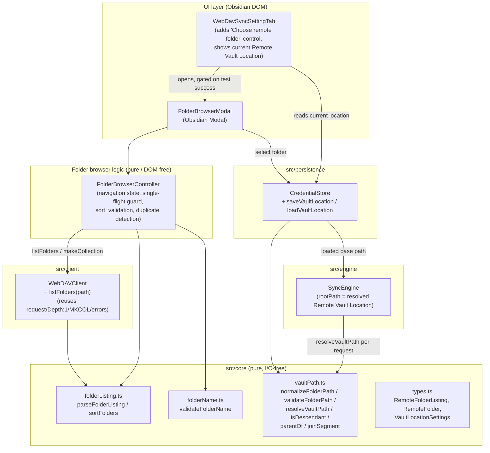

# Design Document

## Overview

This feature adds remote folder selection to the existing Obsidian Synology WebDAV Sync plugin. After a connection test succeeds, the user opens a Folder Browser, navigates the WebDAV server's directory tree one level at a time, selects a folder as the **Remote Vault Location**, and optionally creates a new folder. The selected folder path is persisted alongside the connection settings and becomes the base path the Sync Engine prepends to every remote operation.

The design reuses the existing architecture rather than introducing parallel infrastructure:

- The existing `WebDAVClient` already issues authenticated `PROPFIND` (`Depth: 1`) and `MKCOL` requests through an injected `Transport` with a 30-second timeout, and already classifies failures via the `WebDAVError`/`AuthError`/`RedirectLimitError` hierarchy with a `kind` discriminator. The Folder Browser drives the server through this same client; only one new read path is added to it (listing *child folders* rather than *files*).
- The existing `CredentialStore` persists `ConnectionSettings` under a single key in the shared plugin data object using a read-modify-write that preserves other keys. The Remote Vault Location is persisted with the same pattern.
- The existing `WebDavSyncSettingTab` already exposes testable pure helpers (`loadConnectionSettings`, `saveConnectionSettings`, `runConnectionTest`) and a `clientFactory` injection seam. The folder-browser control is added to this tab, gated on a successful connection test.
- The path math the feature needs — normalization, traversal rejection, and descendant-containment resolution — is implemented as **pure, I/O-free functions in `src/core`**, consistent with `urlJoin`, `validateSettings`, and `decideAction`. These are the highest-value targets for property-based testing.

The central new design challenge is that the existing listing path (`WebDAVClient.listDirectory` → `parseMultistatus`) deliberately keeps only entries that carry both `getlastmodified` and `getcontentlength`, which **excludes collections (directories)**. The Folder Browser needs the opposite slice — the child *collections*. The design therefore adds a sibling pure parser (`parseFolderListing`) that extracts collection entries, and a sibling client method (`listFolders`) that uses it, leaving the file-oriented `listDirectory`/`parseMultistatus` path untouched.

### Research Summary

- **WebDAV collection detection.** In a `207 Multistatus` response, a directory is identified by `<d:resourcetype><d:collection/></d:resourcetype>` on the resource's successful `propstat`. As a fallback some servers (including Synology under certain configurations) signal a collection only by a trailing `/` on the `<d:href>`. The folder parser treats an entry as a collection when **either** signal is present, mirroring how `WebDAVClient.listTree` already uses a trailing-slash href to decide whether to descend.
- **The self-entry.** A `Depth: 1` `PROPFIND` returns the requested directory itself as the first `<response>` (its href equals the requested path). The folder parser must drop this self-entry so a directory does not list itself as its own child — the same concern `listTree` handles with its `normalizeDirKey` comparison.
- **Synology `Depth` behavior** (already captured in the existing client): Synology rejects `Depth: infinity`; the browser only ever needs `Depth: 1`, which is the existing default, so no new request shape is required.
- **`MKCOL` idempotence** (already implemented): `makeCollection` treats `405 Method Not Allowed` as success. For folder *creation* in the browser we want the opposite of idempotence — a name that already exists must be reported as a duplicate (Req 4.6) — so duplicate detection is performed against the already-loaded listing *before* calling the client, and a single-segment create is issued so the result is unambiguous.
- **Obsidian `Modal` on mobile.** Obsidian's `Modal` class and `Setting` controls are mobile-compatible. The browser dialog is a `Modal`, but all decision logic (sorting, validation, duplicate detection, navigation target computation, the in-flight guard) is extracted into pure functions/state so it is unit-testable without a live DOM, mirroring the existing settings-tab helper pattern.

## Architecture



### Control flow

1. **Gating (Req 1.1–1.4).** The settings tab renders a "Choose remote folder" control. It is enabled only while the most recent connection test succeeded *for the currently entered settings*. Editing the endpoint, username, or password invalidates that state and re-disables the control until another test succeeds.
2. **Open + initial listing (Req 1.5–1.7).** Activating the control opens the `FolderBrowserModal` and requests the listing of the server endpoint root (`""`) via `WebDAVClient.listFolders`.
3. **Browse (Req 2).** The controller holds the current folder path. Listings are sorted case-insensitively; navigating into a child or up to the parent requests a new listing. A single-flight guard blocks concurrent requests and drives a loading indication.
4. **Select (Req 3).** A "Use this folder" control persists the current folder path (after normalization) as the Remote Vault Location via the credential store, then the settings tab shows the saved path.
5. **Create (Req 4).** A "New folder" control validates the name locally, checks it against the current listing for duplicates, issues a single `MKCOL` for the child, then refreshes the listing.
6. **Use as base path (Req 3.6, 5.3–5.8).** On load, the plugin reads the stored location and supplies it as the Sync Engine's `rootPath`. Every remote request path is resolved against it through `resolveVaultPath`, which guarantees descendant containment.

## Components and Interfaces

### Core: `src/core/vaultPath.ts` (new, pure)

The path algebra for the Remote Vault Location. No I/O.

```ts
/** Maximum length, in characters, of a stored Folder_Path (Req 5.1, 5.7). */
export const MAX_FOLDER_PATH_LENGTH = 2048;

/**
 * Normalize a Folder_Path (Req 5.2): convert "\" to "/", collapse repeated
 * "/" into one, strip a trailing "/" — except the root, which normalizes to "".
 * The result never has a leading or trailing slash; the root is the empty string.
 */
export function normalizeFolderPath(path: string): string;

export type FolderPathRejection = "too-long" | "traversal";

export type FolderPathValidationResult =
  | { valid: true; normalized: string }
  | { valid: false; reason: FolderPathRejection; message: string };

/**
 * Validate a Folder_Path submitted for persistence (Req 5.7): reject when the
 * normalized form exceeds MAX_FOLDER_PATH_LENGTH characters or contains a ".."
 * segment. On success returns the normalized path.
 */
export function validateFolderPath(path: string): FolderPathValidationResult;

export type ResolveResult =
  | { ok: true; path: string }
  | { ok: false; reason: "escapes-base" };

/**
 * Resolve a vault-relative request path against the Remote Vault Location base
 * (Req 5.3, 5.8). Returns the joined, normalized server-relative path when it is
 * a descendant of (or equal to) the base; otherwise { ok: false } so the caller
 * refuses the request. base === "" means the server endpoint root (Req 5.5).
 */
export function resolveVaultPath(base: string, requestPath: string): ResolveResult;

/** True when `candidate` is the base itself or a descendant of it (Req 5.3). */
export function isDescendant(base: string, candidate: string): boolean;

/** The parent of a normalized folder path, or "" when it has no parent (Req 2.5). */
export function parentOf(path: string): string;

/** Append a single child segment to a base path, normalizing the result (Req 2.4, 4.3). */
export function joinSegment(base: string, segment: string): string;
```

`resolveVaultPath` is the safety boundary for Req 5.8. It normalizes both the base and the request, rejects any request that itself contains `..`, joins them, and confirms the result is still under the base with `isDescendant`. Because `normalizeFolderPath` removes `..`-driven escapes are detected (not silently collapsed) by checking for `..` segments *before* joining, a request can never resolve outside its base.

### Core: `src/core/folderName.ts` (new, pure)

```ts
/** Maximum length, in characters, of a new folder name (Req 4.2, 4.5). */
export const MAX_FOLDER_NAME_LENGTH = 255;

export type FolderNameRejection = "empty" | "too-long" | "illegal-char";

export type FolderNameValidationResult =
  | { valid: true }
  | { valid: false; reason: FolderNameRejection; message: string };

/**
 * Validate a new folder name (Req 4.5): must be 1..255 characters and contain
 * neither "/" nor "\". Pure; performs no duplicate check (that needs the listing).
 */
export function validateFolderName(name: string): FolderNameValidationResult;
```

### Core: `src/core/folderListing.ts` (new, pure)

Extracts child collections from a `207 Multistatus` body and provides the display ordering.

```ts
/**
 * Parse a 207 Multistatus body into the immediate child folders of `requestPath`
 * (Req 1.6, 2.1, 2.2). Keeps only collection entries (resourcetype contains
 * <collection/>, or href ends with "/"), drops the directory's own self-entry,
 * and returns each child's display name and server-relative folder path.
 * Returns { ok: false } when the body is not well-formed XML.
 */
export function parseFolderListing(
  xml: string,
  requestPath: string,
): { ok: true; listing: RemoteFolderListing } | { ok: false; error: "malformed-xml" };

/** Sort folders ascending, case-insensitive, by name (Req 2.2). Pure, stable. */
export function sortFolders(folders: RemoteFolder[]): RemoteFolder[];
```

This module reuses the same namespace-agnostic, `DOMParser`-based XML traversal approach already proven in `responseParser.ts`. A small inverse renderer (`renderFolderListing`) is added for the round-trip property test, mirroring `responseParser.render`.

### Client: `WebDAVClient.listFolders` (new method)

```ts
/**
 * List the immediate child folders of `remotePath` with a PROPFIND Depth:1
 * request, parsed via parseFolderListing (Req 1.5, 2.1). Reuses the existing
 * authenticated request path, 30s timeout, redirect handling, and 401→AuthError
 * mapping; throws WebDAVError "malformed-xml" on an unparseable body.
 */
async listFolders(remotePath: string): Promise<RemoteFolderListing>;
```

It issues the identical `PROPFIND`/`Depth: 1` request as `listDirectory` (the request builder already asks for `resourcetype`), but routes the body through `parseFolderListing` instead of `parseMultistatus`. Folder *creation* reuses the existing `makeCollection`, but the controller passes a single resolved child path (`joinSegment(current, name)`) so exactly one collection is created.

### Persistence: `CredentialStore` additions

```ts
/** Key under which the Remote Vault Location is stored in the plugin data object. */
export const VAULT_LOCATION_KEY = "remoteVaultLocation";

/**
 * Persist the Remote Vault Location Folder_Path (Req 3.2, 5.1). Reads the data
 * object, updates only its own key, writes the whole object back so connection
 * settings, retry queue, and error log are preserved.
 */
async saveVaultLocation(path: string): Promise<void>;

/** Load the stored Remote Vault Location, or null when none is stored (Req 3.5, 3.7, 5.6). */
async loadVaultLocation(): Promise<string | null>;
```

The store assumes the path was already normalized and validated by the caller (the settings/select flow uses `validateFolderPath` before persisting, Req 5.7), and re-applies `normalizeFolderPath` defensively on save so the stored form is always canonical.

### UI: `WebDavSyncSettingTab` additions

- A new "Remote vault location" section displays the current location (the stored `Folder_Path`, or "No remote folder selected yet" when none — Req 3.5, 3.7) and a **"Choose remote folder"** button.
- The button is enabled only when `connectionVerified === true`. The existing `runConnectionTest` helper is extended so a successful result sets `connectionVerified` and a snapshot of the tested settings; the field `onChange` handlers clear `connectionVerified` whenever the live draft differs from that snapshot (Req 1.2–1.4). This gating predicate is extracted into a pure helper `isFolderBrowsingEnabled(verifiedSettings, draft)` for unit testing.
- Activating the button opens `FolderBrowserModal`, injecting a `clientFactory` (reusing the existing pattern) and the `CredentialStore`. On modal close with a selection, the tab re-reads and re-renders the current location and shows a confirmation notice (Req 3.3).

### UI: `FolderBrowserModal` + `FolderBrowserController`

`FolderBrowserModal extends Modal` owns only DOM rendering and event wiring. All behavior lives in `FolderBrowserController`, a DOM-free class that is unit-testable with a fake client:

```ts
export interface FolderBrowserClient {
  listFolders(path: string): Promise<RemoteFolderListing>;
  makeCollection(path: string): Promise<void>;
}

export type BrowserState = {
  currentPath: string;          // normalized server-relative path
  folders: RemoteFolder[];      // sorted children of currentPath
  loading: boolean;             // single-flight guard (Req 2.6)
  error: string | null;         // last error message (Req 1.7, 2.7–2.9, 4.7, 4.8)
  creating: boolean;            // create-in-flight guard (Req 4.9)
};

export class FolderBrowserController {
  // navigate(path), navigateToParent(), refresh(): each is a no-op when
  // loading is already true (single-flight). On success replaces folders with
  // sortFolders(listing); on failure sets error and leaves currentPath/folders
  // unchanged (Req 2.7–2.9, 1.7).
  // createFolder(name): validateFolderName -> duplicate check against folders ->
  // makeCollection(joinSegment(currentPath, name)) -> refresh (Req 4.3–4.8).
}
```

The controller maps thrown `WebDAVError`s to user messages by their `kind`: `auth-failure` → authentication message (Req 2.9, 4.7), timeout (detected by the client's existing timeout handling surfacing through the 30 s `REQUEST_TIMEOUT_MS`) → timeout message (Req 2.7, 4.8), everything else → connectivity/server message (Req 2.8, 4.7). On any failure the current path and displayed listing are left unchanged.

### Engine integration

`SyncEngine` already accepts `rootPath` and prepends it implicitly through the client (it passes `rootPath` to `listTree`, and per-file paths to `putFile`/`getFile`). To honor Req 5.3/5.6/5.8 the plugin wraps the injected `SyncEngineClient` so every path argument is first run through `resolveVaultPath(base, path)`, where `base` is the loaded Remote Vault Location. A request that fails containment is refused with an error indication rather than issued (Req 5.8). When no location is stored, `base === ""` (the server root, Req 5.5).

## Data Models

New shared types added to `src/core/types.ts`:

```ts
/** A single child collection (directory) on the WebDAV server (Req 2.x). */
export interface RemoteFolder {
  /** Display name (the last path segment), e.g. "Notes". */
  name: string;
  /** Server-relative, normalized Folder_Path of this folder, e.g. "vault/Notes". */
  path: string;
}

/** The immediate child folders of a single browsed Remote_Folder (Req 1.6, 2.1). */
export interface RemoteFolderListing {
  /** The normalized Folder_Path of the folder that was listed. */
  path: string;
  /** Immediate child folders only (no files, no self-entry). */
  folders: RemoteFolder[];
}
```

The Remote Vault Location is stored as a plain `string` `Folder_Path` (0–2048 chars, `""` = server root) under `VAULT_LOCATION_KEY` in the shared plugin data object, so no schema change is forced on `ConnectionSettings`. This keeps the credential store's preserve-other-keys contract intact and lets the location be absent without making connection settings partial.

**Persistence layout** (single plugin data JSON blob):

```json
{
  "connectionSettings": { "endpoint": "…", "username": "…", "password": "…" },
  "remoteVaultLocation": "vault/Notes",
  "retryQueue": "…",
  "errorLog": { "…": "…" }
}
```

## Correctness Properties

*A property is a characteristic or behavior that should hold true across all valid executions of a system — essentially, a formal statement about what the system should do. Properties serve as the bridge between human-readable specifications and machine-verifiable correctness guarantees.*

The properties below were derived from the acceptance-criteria prework. After the initial analysis a redundancy reflection was applied: the positive descendant-containment criterion (5.3/3.6/5.5) and the negative escape-rejection criterion (5.8) were combined into a single comprehensive `resolveVaultPath` property (Property 2), since both describe the same total function; the per-error-kind "leave state unchanged on failure" criteria (1.7, 2.7, 2.8, 2.9, 4.7, 4.8) were combined into one failure-invariance property over the browser controller (Property 11); the path-length and traversal-rejection criteria (5.1, 5.7) were combined into one validation property (Property 3); and the gating criteria (1.2, 1.4) were combined into one predicate property (Property 12). UI-timing and presence criteria (1.1, 1.3, 1.5, 2.3, 2.4, 2.6, 2.10, 3.1, 3.3, 3.5, 3.7, 4.1, 4.3, 4.4, 4.9, 5.5, 5.6) are covered by example/edge-case tests in the Testing Strategy rather than properties.

### Property 1: Folder path normalization is canonical and idempotent

*For any* string path, `normalizeFolderPath(path)` produces a result that contains no backslash, contains no `"//"` doubled separator, has no leading or trailing `"/"` (the root normalizes to the empty string), and applying `normalizeFolderPath` again leaves it unchanged (idempotence).

**Validates: Requirements 5.2**

### Property 2: Resolved request paths stay within the vault location

*For any* base Folder_Path and *any* request path, `resolveVaultPath(base, requestPath)` either returns `{ ok: true, path }` where `path` is `isDescendant(base, path)` (equal to or nested under the normalized base), or returns `{ ok: false }`; and it returns `{ ok: false }` exactly when the request path contains a parent-directory traversal (`".."`) segment that would escape the base. When `base` is `""` (no location selected) the resolved path equals `normalizeFolderPath(requestPath)`.

**Validates: Requirements 3.6, 5.3, 5.5, 5.8**

### Property 3: Over-long or traversing paths are rejected for persistence

*For any* string path, `validateFolderPath(path)` returns `{ valid: false }` when the normalized path exceeds 2048 characters or contains a `".."` segment, and otherwise returns `{ valid: true, normalized }` with `normalized` equal to `normalizeFolderPath(path)` and at most 2048 characters.

**Validates: Requirements 5.1, 5.7**

### Property 4: Navigating into a child and back to the parent is an identity

*For any* normalized folder path `p` and *any* single non-empty, slash-free segment `s`, `parentOf(joinSegment(p, s))` equals `p`, and `joinSegment(p, s)` is a descendant of `p` exactly one segment deeper.

**Validates: Requirements 2.4, 2.5, 4.3**

### Property 5: Folder listing parse round-trip

*For any* `RemoteFolderListing` of child folders, rendering it as an equivalent well-formed `207 Multistatus` document (including the directory's own self-entry and a `<collection/>` resourcetype on each child) and parsing it with `parseFolderListing` yields a listing whose `folders` preserve each original child's name and path, with files and the self-entry excluded.

**Validates: Requirements 1.6, 2.1**

### Property 6: Folders are displayed in case-insensitive ascending order

*For any* array of `RemoteFolder` values, `sortFolders` returns a permutation of the input whose names are in non-decreasing case-insensitive alphabetical order.

**Validates: Requirements 2.2**

### Property 7: New folder name validation enforces length and character rules

*For any* string name, `validateFolderName(name)` returns `{ valid: true }` if and only if the name is 1 to 255 characters long and contains neither `"/"` nor `"\"`; every empty, over-255-character, or slash/backslash-containing name is rejected.

**Validates: Requirements 4.2, 4.5**

### Property 8: A duplicate name never triggers a server create

*For any* `RemoteFolderListing` and *any* name equal (exactly) to the name of an existing child folder in it, `FolderBrowserController.createFolder(name)` reports a duplicate and never calls `makeCollection`; for any valid name not present in the listing it issues exactly one `makeCollection` call.

**Validates: Requirements 4.6, 4.5**

### Property 9: Vault location persistence round-trips and is last-write-wins

*For any* sequence of one or more valid Folder_Paths persisted in order through `CredentialStore.saveVaultLocation`, a subsequent `loadVaultLocation` returns the normalized form of the most recently saved path, and all other persisted keys (connection settings, retry queue, error log) present before the save are preserved unchanged.

**Validates: Requirements 3.2, 5.4**

### Property 10: A failed or rejected persistence leaves the stored location unchanged

*For any* previously stored Remote_Vault_Location and *any* candidate that is rejected by `validateFolderPath` or whose underlying data-store write throws, the stored Remote_Vault_Location afterwards equals the previously stored value (no partial or cleared write).

**Validates: Requirements 3.4, 5.7**

### Property 11: A failed listing or creation leaves the browsed folder unchanged

*For any* browser state and *any* client call (`listFolders` or `makeCollection`) that rejects with a `WebDAVError` (auth, timeout, connectivity, server, or malformed), `FolderBrowserController` leaves `currentPath` and the displayed `folders` unchanged and records a non-empty error message classified by the error's `kind`.

**Validates: Requirements 1.7, 2.7, 2.8, 2.9, 4.7, 4.8**

### Property 12: Folder browsing is enabled only for verified, unchanged settings

*For any* verified-settings snapshot and *any* current draft settings, `isFolderBrowsingEnabled(snapshot, draft)` is `true` if and only if a snapshot exists and the draft's endpoint, username, and password all equal the snapshot's; any difference, or the absence of a snapshot, yields `false`.

**Validates: Requirements 1.2, 1.4**

## Error Handling

All server-facing errors reuse the existing `WebDAVError` hierarchy and its `kind` discriminator, so the Folder Browser never string-matches messages:

- **Listing failures (Req 1.7, 2.7, 2.8, 2.9).** `WebDAVClient.listFolders` propagates `AuthError` (`kind: "auth-failure"`), `RedirectLimitError`, `WebDAVError` (`server-error`, `malformed-xml`), and transport timeouts. The controller catches all of them, sets a `kind`-specific message (authentication rejected / timed out / could not be reached / unexpected server response), and leaves `currentPath` and `folders` untouched (Property 11). The 30-second budget is enforced by the existing `REQUEST_TIMEOUT_MS` in the transport; the browser does not add its own timer.
- **Initial-open failure (Req 1.7).** A failed root listing keeps the previously selected Remote_Vault_Location unchanged (no persistence call is made on a failed open) and shows the listing error.
- **Creation failures (Req 4.7, 4.8).** `createFolder` validates locally first (no server contact on invalid names or duplicates — Req 4.5, 4.6). A failed `makeCollection` is mapped exactly like a listing failure and leaves the displayed listing unchanged; the create control is re-enabled.
- **Persistence failures (Req 3.4, 5.7).** `saveVaultLocation` is wrapped so a thrown data-store error, or a candidate rejected by `validateFolderPath`, surfaces an error notice and leaves the stored value intact (Property 10).
- **Containment violations (Req 5.8).** When `resolveVaultPath` returns `{ ok: false }`, the wrapping `SyncEngineClient` proxy throws before issuing any request and the failure is reported through the existing error log / status reporter, so a traversal can never reach the network.
- **Malformed listing XML.** `parseFolderListing` returns `{ ok: false, error: "malformed-xml" }`, which `listFolders` converts to a `WebDAVError("malformed-xml")`, handled as a generic listing failure.

## Testing Strategy

The project uses **vitest** with `fast-check` for property tests and an in-memory `FakeTransport`/fakes for I/O. The feature favors pure, DOM-free functions so the bulk of behavior is unit- and property-testable without a live Obsidian DOM, mirroring the existing settings-tab helper pattern.

### Property-based tests

`fast-check` is the existing PBT library; each property test runs a minimum of 100 iterations and is tagged with a comment referencing its design property in the form **`Feature: remote-folder-selection, Property N: <text>`**. One property-based test implements each of Properties 1–12:

- Properties 1–4 (`vaultPath.ts`): normalization invariants/idempotence, `resolveVaultPath` containment and escape rejection, `validateFolderPath` length/traversal rejection, and the `parentOf`/`joinSegment` inverse. Generators include backslashes, repeated/leading/trailing slashes, `".."` segments, unicode segments, and lengths straddling the 2048-character bound.
- Property 5 (`folderListing.ts`): `parseFolderListing(renderFolderListing(listing))` round-trip, with generators that mix collection and file entries plus the self-entry so exclusion is exercised.
- Property 6 (`folderListing.ts`): `sortFolders` ordering and permutation, with mixed-case and unicode names.
- Property 7 (`folderName.ts`): `validateFolderName` accept/reject, with generators for empty strings, lengths around 255, and names embedding `"/"`/`"\\"`.
- Property 8 (`FolderBrowserController`): duplicate-name detection against a generated listing, asserting `makeCollection` call counts via a fake client.
- Property 9–10 (`CredentialStore`): save/load round-trip and last-write-wins with preservation of sibling keys, and unchanged-on-failure using an in-memory data store that can be made to throw.
- Property 11 (`FolderBrowserController`): failure invariance across generated `WebDAVError` kinds using a fake client that rejects.
- Property 12 (settings-tab gating helper): `isFolderBrowsingEnabled` over generated snapshot/draft pairs with single-field mutations.

### Unit and integration (example/edge-case) tests

Example-based tests cover the criteria that are not universal properties:

- **Gating wiring (1.1, 1.3, 1.5):** the "Choose remote folder" control exists, becomes enabled after a successful `runConnectionTest`, and opening it calls `listFolders("")`.
- **Empty listing (2.3) and path display (2.10):** an empty-state indication and the current Folder_Path are shown.
- **Navigation and single-flight (2.4, 2.6):** navigating calls `listFolders` with the child path; a second request while one is pending is a no-op (one call issued).
- **Selection feedback (3.1, 3.3, 3.5, 3.7):** select is enabled while browsing; success re-renders the stored path with a confirmation; start-up shows the stored path or the "none selected" indication.
- **Creation flow (4.1, 4.3, 4.4, 4.9):** the control exists; a valid name issues one `makeCollection(joinSegment(current, name))` then refreshes; the control is disabled while a create is in flight.
- **Defaults and load-on-start (5.5, 5.6):** a missing location resolves the base to `""` (server root); start-up loads the stored normalized location as the base.
- **Error-message mapping:** representative `AuthError`, timeout, and server-error cases map to the expected user messages (complementing the failure-invariance property).

Property-based tests verify universal correctness across the input space; unit/integration tests pin down the concrete wiring, edge cases, and user-facing messages. Together they give comprehensive coverage of all five requirements.
